# Mr-Robot-1

## Overview :
- Flag Count: 3
- OVA link: https://www.vulnhub.com/entry/mr-robot-1,151/
- Tools used: netdiscover, nmap, nikto, hashcat

Hello, and welcome to my first installment of the VulnHub VM Write-ups!

If you never heard of **[VulnHub](https://www.vulnhub.com/entry/mr-robot-1,151/)**, then let me briefly explain what they do. Their purpose is to provide materials that will allow anyone to gain practical ‘hands-on’ experience in digital security, computer software & network administration. Like many other CTF’s, VulnHub in particular was born to cover as many resources as possible, creating a catalogue of ‘stuff’ that is (legally) ‘breakable, hackable & exploitable’ - allowing you to learn in a safe environment and practice ‘stuff’ out.
Before we begin, if you would like to try out the **Mr.Robot VM**, or follow along and learn as I go, then you can download it **[here!](https://www.vulnhub.com/entry/mr-robot-1,151/)**

Alrighty then, I know you’re as eager as me to get your hands dirty with this CTF - so, let’s begin!

## Description :
Based on the show, Mr. Robot.
This VM has **three keys hidden** in different locations. Your goal is to find all three. Each key is progressively difficult to find.
The VM isn’t too difficult. There isn’t any advanced exploitation or reverse engineering. The level is considered beginner-intermediate.

## The Hack :
So the first step in any Pentest - whether it’s Network or Web - (besides OSINT!) - is **Intelligence Gathering**. That includes **Footprinting** and **Fingerprinting** hosts, servers, etc.
If you want to learn more about the proper procedures and steps then I suggest you read the PTES Technical Guidelines.

Since the **Mr.Robot** VM is being hosted on my PC using a **Bridged Adapter** over VirtualBox, we will go ahead and scan our network to see if we can’t get the IP. To do so, type in **netdiscover** in your terminal.

```sudo netdiscover
sudo netdiscover
```
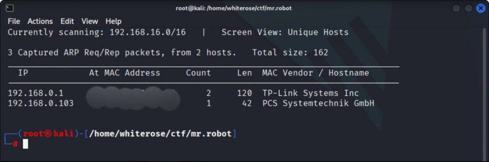
The IP of 192.168.0.103 will be our target. Once we got that, let’s go ahead and run an nmap scan to check for any open ports and probe for running services.

```nmap -sS -T4 192.168.0.103
nmap -sS -T4 192.168.0.103
```

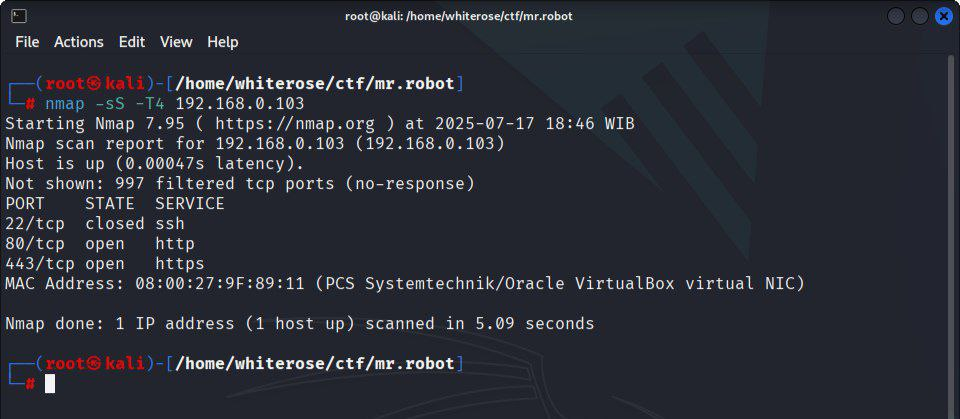

After running a quick command on nmap, I see ports 22, 80, and 443 are open. Okay, since we know this is a web server… let’s run nikto to scan for any “possible” vulnerabilities or misconfigurations.

```nikto -h 192.168.0.103
nikto -h 192.168.0.103
```


A few interesting things come up in the scan.

1. We see that the server is leaking inodes via ETags in the header of /robots.txt. This relates to the CVE-2003-1418 vulnerability. These Entity Tags are an HTTP header which are used for Web cache validation and conditional requests from browsers for resources.
2. Apache mod_negotiation is enabled with MultiViews, which will allow us to use a brute force attack in order to discover existing files on a server which uses mod_negotiation.
3. The following alternatives for ‘index’ were found: index.html, and index.php. These can be used to provide us with more info on the website.
4. OSVDB-3092: /admin/: This might be interesting… if we have a login. Good to keep that in the back of our mind.
- /admin/index.html: Admin login page/section found - also relates to the above scan.
5. /readme.html: This WordPress file reveals the installed version.
- Basically tells us that this is a WordPress Site! So we know we can look for WordPress Vulnerabilities.
- /wp-links-opml.php: This WordPress script reveals the installed version.
- /wp-login/: Admin login page/section found.
- /wp-admin/wp-login.php: Wordpress login found.
6. OSVDB-3092: /license.txt: License file found may identify site software. Which can help us get version information of plugins and services to look for exploits.

Alright, we got our initial footprint, let’s go ahead and access the website in our browser by navigating to 192.168.0.103.
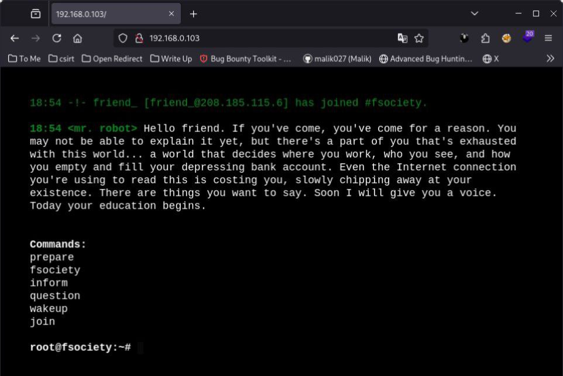

es - I came here for a reason, to hack you! Anyways, that website is actually pretty freakin cool!
We can see that we are able to run 6 commands in the interface, each does its own little thing. So go ahead and play around with them - I did, and thoroughly enjoyed it - but, let’s get back to the CTF!
We already know that there are leaking indoes via ETags at /robots.txt, which is basically a text file that is used to prevent crawlers from indexing portions of the website. Let’s go ahead and navigate to http://192.168.0.103/robots.txt.

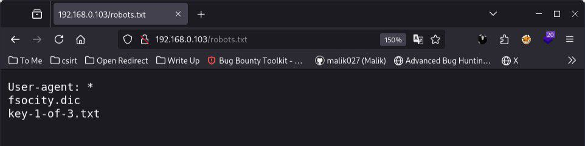

Nice! We got 2 locations we can navigate to fsocity.dic and key-1-of-3.txt. Of course… I want the key! So let’s navigate to http://192.168.0.103/key-1-of-3.txt.

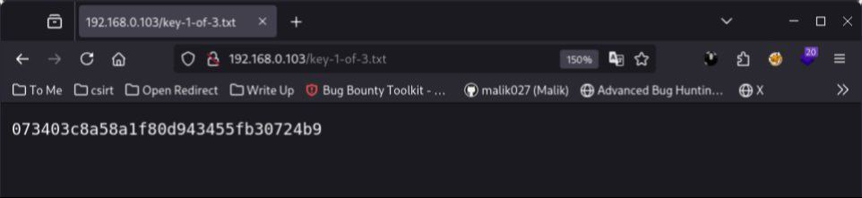

```073403c8a58a1f80d943455fb30724b9
073403c8a58a1f80d943455fb30724b9
```
Yay! We got the fist key! Let’s keep moving on… It ain’t over yet, ain’t over yet! Move, keep walkin’ until the mornin’ comes! (Sorry, got carried away again.)

Since we got 2 locations from /robots.txt, let’s navigate to http://192.168.1.9/fsocity.dic and see what we have left.

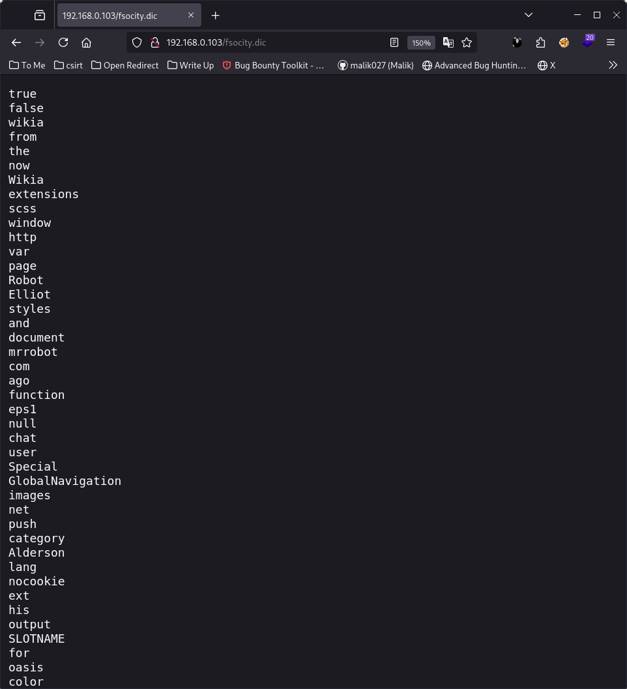

Interesting… looks like this is a C Source Code file. Maybe we can use it for brute force… but let's save it for later!

Alright, we now know that the WordPress site is Version 4.3.6, we can use that to our advantage later! Next best thing to try is the /license.txt location.

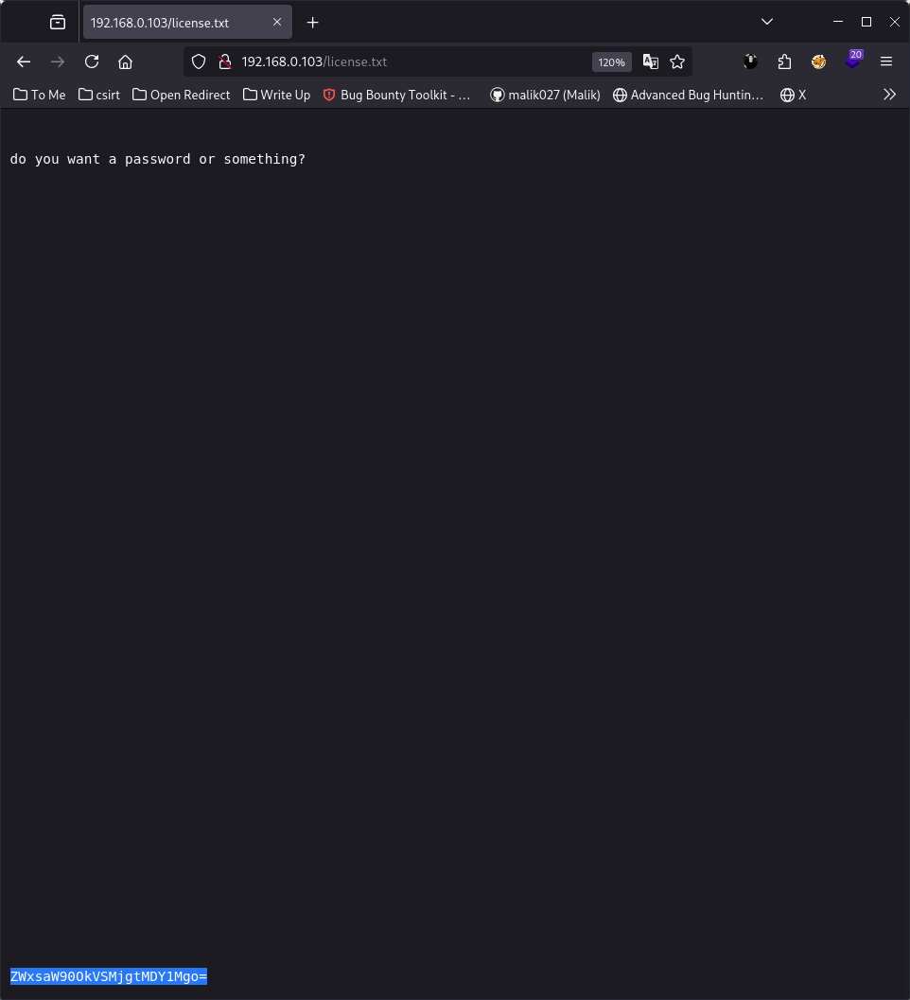

When we get to that page, we can see Mr. Robot calling us a script cat... okayyy. Looks like there's more to that page, scroll down and see what we can find! Nani! We got the password for... uh... something. It looks like the password is encrypted with base64. We can even decode it in our terminal!

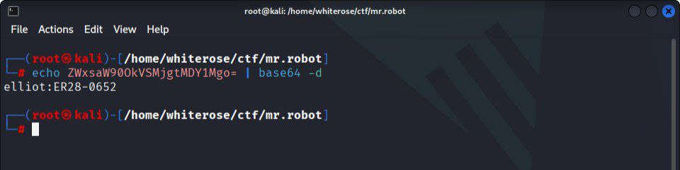

Ok, we got a username and a password. I wonder where we can use this. Hmm… let’s try and use the admin login page /wp-login/ that was found by nikto.

Once we are logged in as Elliot, we also see that we are the WordPress Site admin. Let’s scour around and see what we can find!

From the looks of it, I see we have access to Updates and Plugins. We can go ahead and check Plugin versions.

Upon checking Plugins, we get the following:

- Akismet - Version 3.1.5
- All in One SEO Pack - Version 2.2.5.1
- All-in-One WP Migration - Version 2.0.4
- Contact Form 7 - Version 4.1
- Google Analytics by Yoast - Version 5.3.2
- Google XML Sitemaps - Version 4.0.8
- Hello Dolly - Version 1.6
- Jetpack by WordPress.com - Version 3.3.2
- Simple Tags - Version 2.4
- WP-Mail-SMTP - Version 0.9.5
- WPtouch Mobile Plugin - Version 3.7.3

With this, I will go ahead by downloading and uploading **[shell-reverse-php](https://pentestmonkey.net/tools/web-shells/php-reverse-shell)**, which can allow us to get a shell or reverse connection from the server we are targeting.

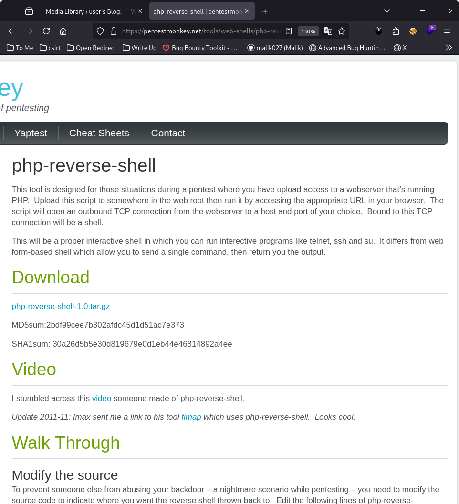

After downloading, don't forget to configure the shell a little, then upload it to the Media section.

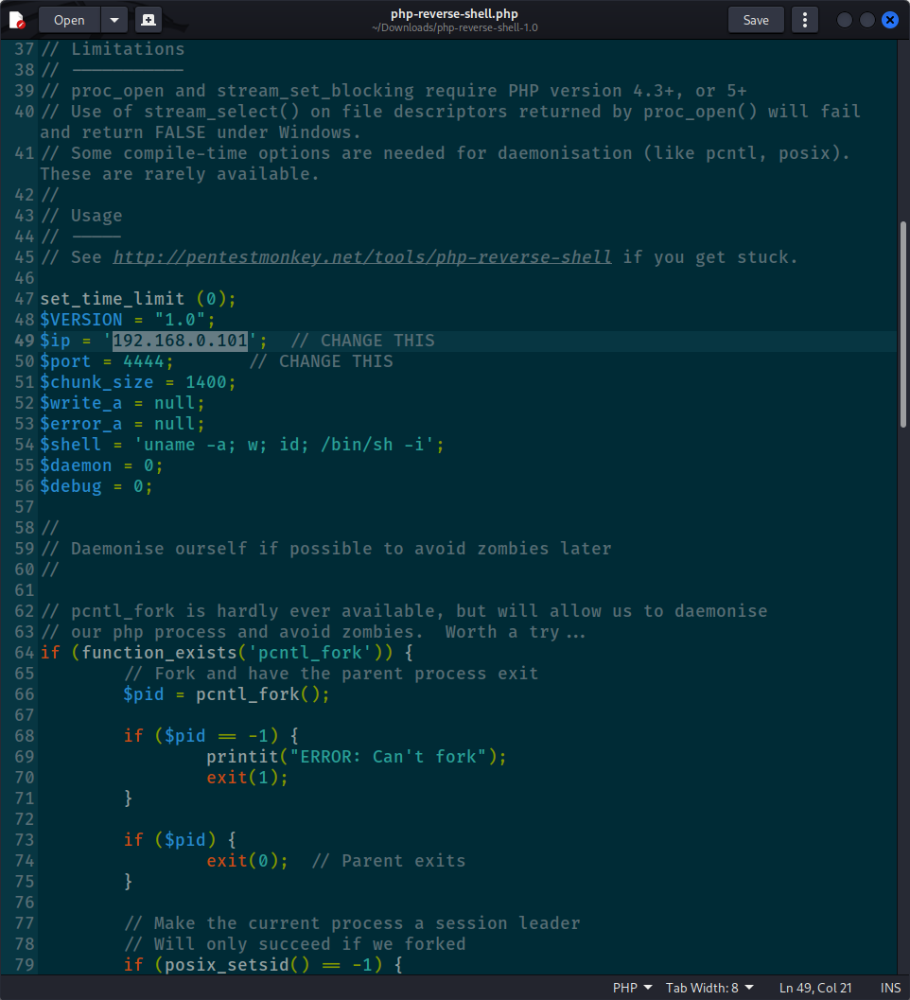

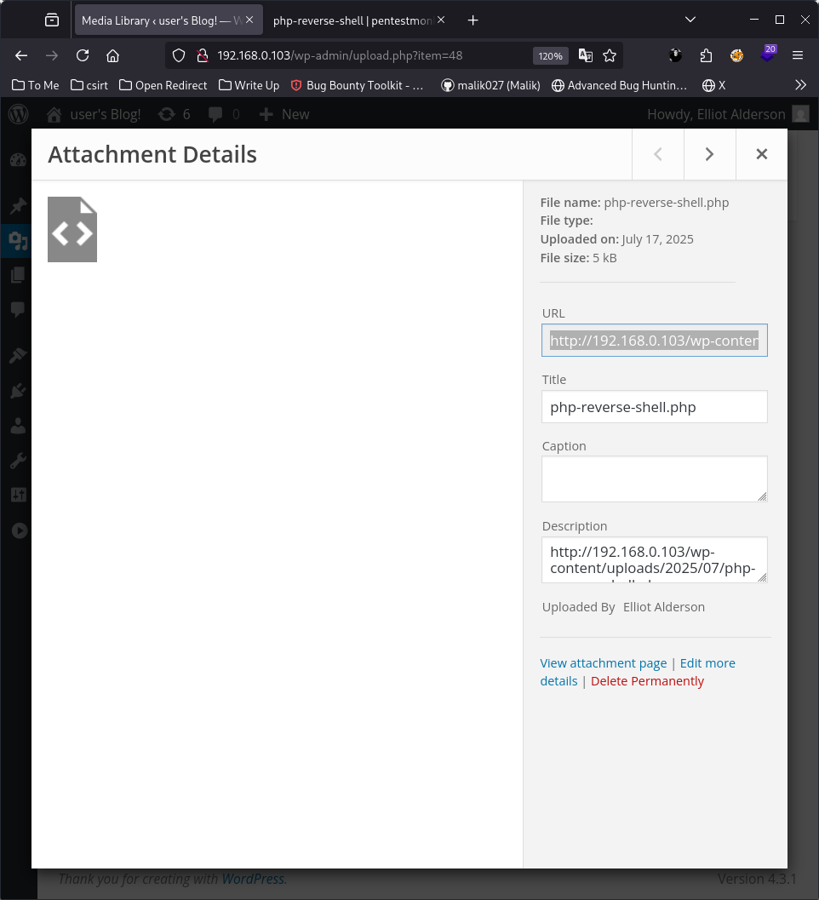

After the upload is successful, run netcat and navigate the browser to the URL of the file that has been successfully uploaded.

```netcat -lnvp 444
netcat -lnvp 444
```

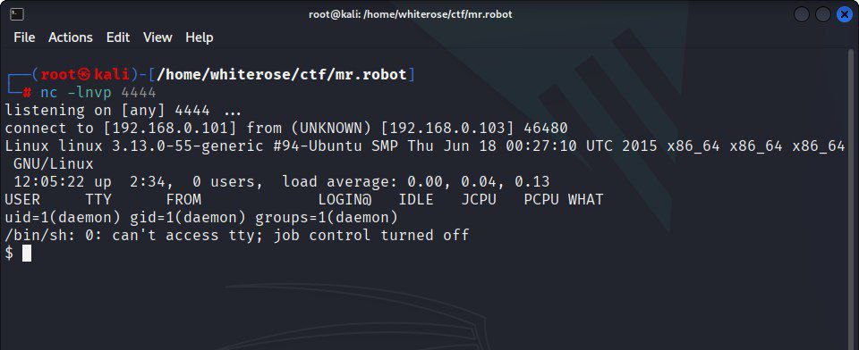

Awesome! We got the shell up and running on the host! Let’s snoop around to see what we can find!

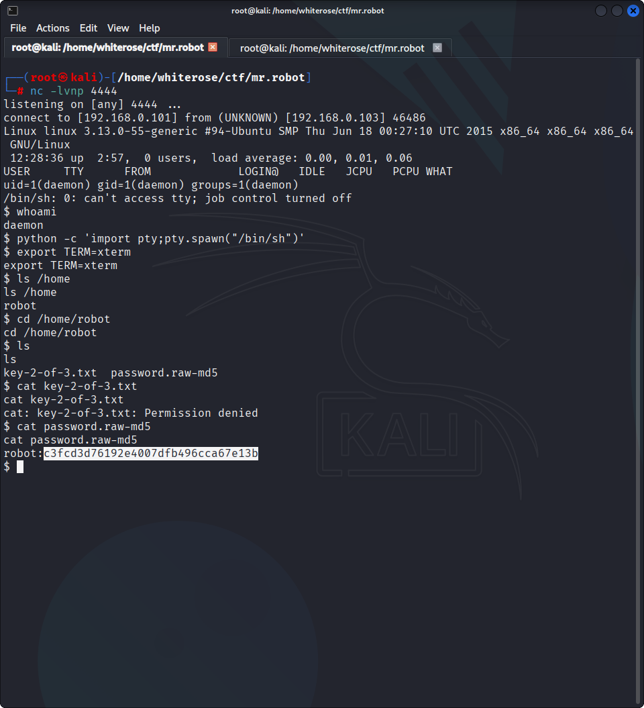

Okay, I found the second key, but I don't have permission to view the text, and it looks like we have an MD5 hash of the bot's username. Let's use Hashcat and see if it can crack the MD5 hash for us.
Copy the hash key and create an .md5 file to use as the hash. You can follow the instructions I used, or use any other command you like.

```echo "c3fcd3d76192e4007dfb496cca67e13b" | tee password.md5
echo "c3fcd3d76192e4007dfb496cca67e13b" | tee password.md5
```

```hashcat -a 0 -m 0 password.md5 /usr/share/wordlists/rockyou.txt -o crack.txt
hashcat -a 0 -m 0 password.md5 /usr/share/wordlists/rockyou.txt -o crack.txt
```
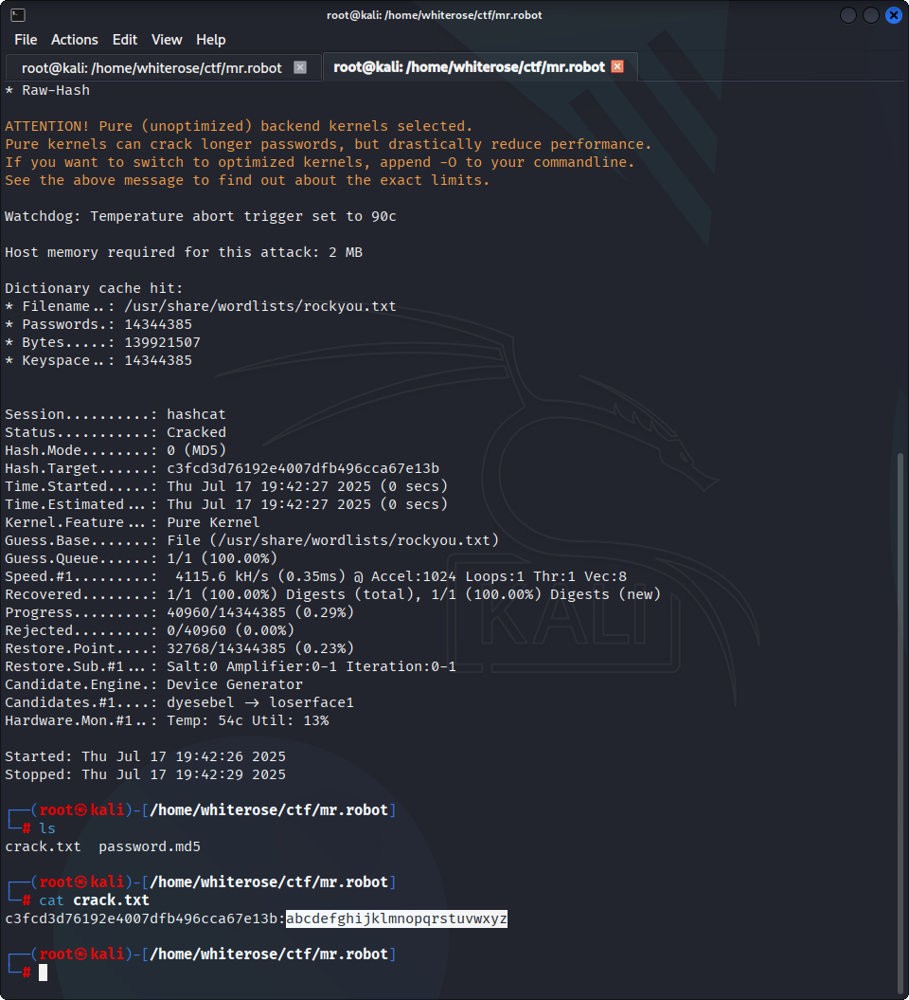

Oh man, that's a terrible password! Who cares, it's easy to crack!

Since we have the password and the session on the host, let's see if we can log in as the robot user.

Okay, we got shell! Now we want to be able to login to robot. So what we need to do is establish a TTY Shell. We can do so by typing the following line:

```python -c 'import pty;pty.spawn("/bin/sh")'
python -c 'import pty;pty.spawn("/bin/sh")'
```

Here is a good resource where you can read more about Spawning a TTY Shell.
Once in, we can login as robot and get the second flag!

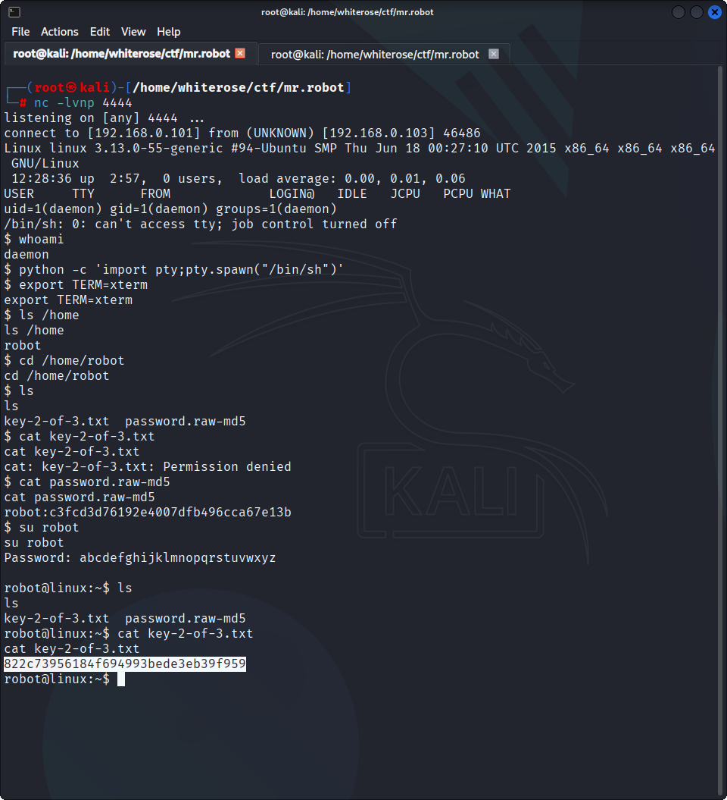

### Key 2 :
```key 2 :
822c73956184f694993bede3eb39f959
```

Okay, go do a victory lap around the house! You deserve it! Though… we’re still not done. Still got 1 more key to find!
Since we exploited the host, and got in - our next step is to carry out Post-Explotation and further Enumeration on the internal side.

next thing i usually do is look for SUID binaries and see what we can exploit to get to the top.

```find / -perm -4000 -type f 2>/dev/null
find / -perm -4000 -type f 2>/dev/null
```

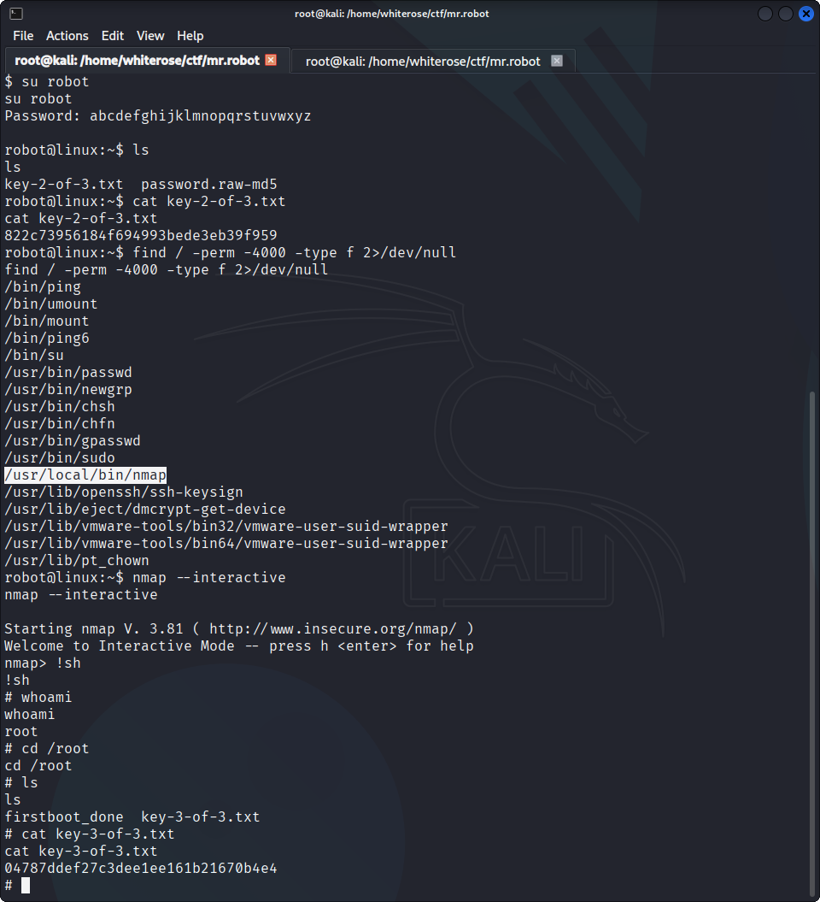

Awesome! The host in running an old version of nmap, which supports an option called “interactive.” With this option, users are able to execute shell commands by using an nmap “shell”.

```nmap --interactive
nmap --interactive
```
### key 3 :

```key 3 :
04787ddef27c3dee1ee161b21670b4e4
```

## Closing
And there we have it! We captured all three keys, and rooted the system!
If this was a real engagement, we would be able to do a lot more damage, now that we have root privileges. Well, I hoped you guys enjoyed this post as much as I enjoyed pwning Mr. Robot!
This box was really well put together and honestly challenged me - at the same time I learned a lot about the hacking process and some new exploitations, along with many valuable lessons.
